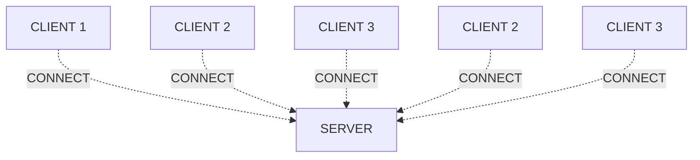
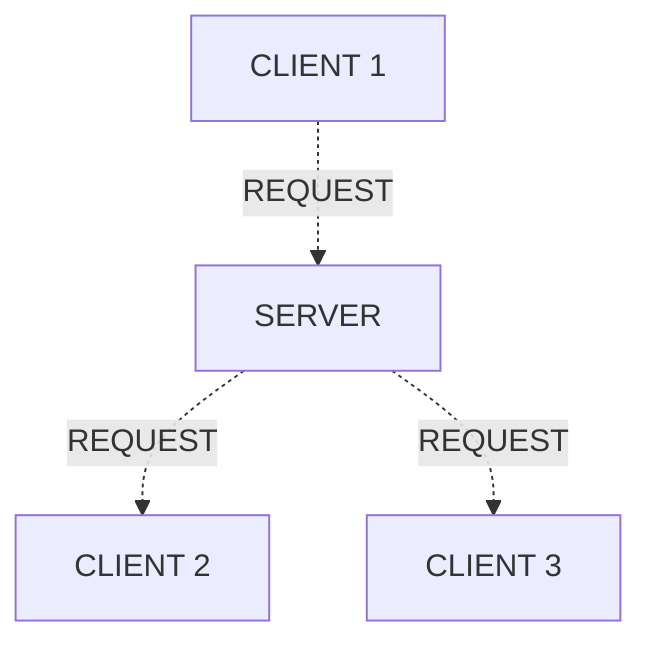
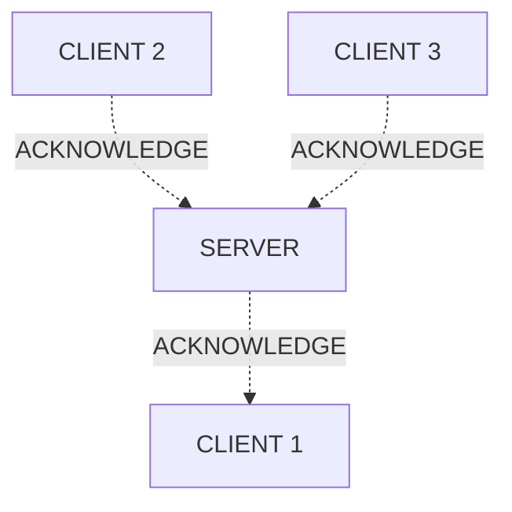

# condvisa

Clients connect to the server and tell their phone numbers,   and the server saves those in a data structure. 

Client 1 sends a payment request to the server with the phone numbers,   and the server searches for those phone numbers and sends them the payment request.

